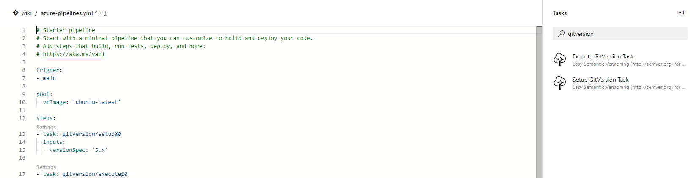
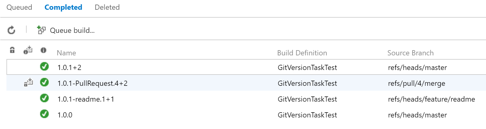

# GitTools bundle for Azure Pipelines

Versioning when using Git, solved. GitVersion looks at your Git history and works out the [semantic version](https://semver.org) of the commit being built.

It works with most branching strategies but has been designed mainly around GitFlow and GitHubFlow (pull request workflow). The calculated version numbers can then be accessed through variables such as `$(GitVersion_FullSemVer)` and `$(GitVersion_SemVer)`. It is also very configurable to allow it to work with most release workflows!

## Azure Pipelines tasks

## Azure Pipelines run examples

